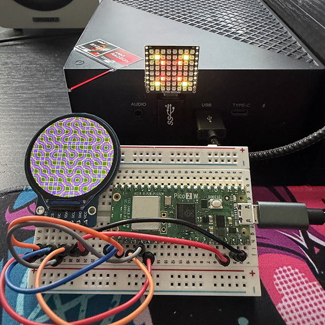

# Pico 2 W Random Art Bot

A small autonomous generative-art project using a **Raspberry Pi Pico 2 W** to create procedural artwork, send the resulting images over WiFi to a local Python server, display them in a Vite-powered web gallery, and automatically post them to **Bluesky**.



The goal is simple: let the hardware continuously create random artwork and occasionally share it with the world.

## How It Works

```text
┌──────────────────┐
│   Raspberry Pi   │
│      Pico 2 W    │
│                  │
│  Generate Art    │
└────────┬─────────┘
         │
         │ WiFi
         ▼
┌──────────────────┐
│   Python Server  │
│                  │
│  Receive Images  │
│  Save PNG Files  │
│  Image API       │
└────────┬─────────┘
         │
         ├──────────────────┐
         │                  │
         ▼                  ▼
┌──────────────────┐  ┌──────────────────┐
│   Vite Gallery   │  │   Python Bot     │
│                  │  │                  │
│  TypeScript      │  │  Find New Art    │
│  SCSS            │  │  Post to Bluesky │
│  Pagination      │  │  Track Posts     │
└──────────────────┘  └────────┬─────────┘
                               │
                               ▼
                      ┌──────────────────┐
                      │     Bluesky      │
                      │                  │
                      │  Random Artwork  │
                      │  + Caption       │
                      └──────────────────┘
```

The project is intentionally split into independent pieces. The Pico generates the artwork, the Python server handles receiving and serving images, the Vite application provides the gallery, and the Python bot handles social-media posting.

## Pico 2 W

The artwork is generated directly on a **Raspberry Pi Pico 2 W**.

The Pico creates the procedural/pixel artwork and sends the resulting RGB565 image data over WiFi to the Python server.

The server converts the raw RGB565 data into PNG files using Pillow.

Images are stored using sequential filenames such as:

```text
tile_0001.png
tile_0002.png
tile_0003.png
...
```

The original artwork is generated at **240×240 pixels**.

The Pico is responsible for generating the artwork; image storage, the web gallery, and social-media posting are handled separately so the microcontroller can concentrate on rendering.

## Python Image Server

The Python server acts as the bridge between the Pico and the web gallery.

It:

* Receives artwork from the Pico over WiFi.
* Converts RGB565 image data into PNG.
* Saves images to the `images/` directory.
* Provides an API containing the available images.
* Serves the generated PNG files to the Vite gallery.

The server currently runs on port `8080`.

### API

The image list is available at:

```text
GET /api/images
```

which returns a JSON array of filenames:

```json
[
    "tile_0012.png",
    "tile_0011.png",
    "tile_0010.png"
]
```

Individual images are served from:

```text
GET /images/tile_0012.png
```

This keeps the gallery independent from the filesystem. The frontend doesn't need direct access to the `images/` directory; it communicates with the Python server through HTTP.

## Gallery

The gallery is a small **Vite + TypeScript + SCSS** application.

Rather than being a collection of static HTML files, the gallery fetches the available artwork from the Python server's API.

The current gallery provides:

* Responsive image grid
* 12 images per page
* Simple `< 1 2 3 >` pagination
* Pixel-art friendly image scaling
* Click-to-open image modal
* Large image display using nearest-neighbor/pixelated rendering
* Repeating image backgrounds in the image viewer

The frontend structure is approximately:

```text
src/
├── main.ts
├── gallery.ts
└── style.scss

index.html
vite.config.ts
package.json
tsconfig.json
```

During development, Vite runs on its own development server while proxying API and image requests to the Python server.

```text
Vite
localhost:5173
     │
     ├── /api/*
     │
     └── /images/*
              │
              ▼
       Python Server
       localhost:8080
```

This allows the frontend to simply request:

```text
/api/images
/images/tile_0012.png
```

without hard-coding the Python server's address into the TypeScript application.

## Running the Gallery

Install the Node dependencies:

```bash
npm install
```

Start the Vite development server:

```bash
npm run dev
```

Vite will provide a local development URL, typically:

```text
http://localhost:5173
```

The Python image server must also be running so the gallery can retrieve the artwork.

## Bluesky Bot

A separate Python bot watches the local gallery directory for artwork that hasn't been posted yet.

When new artwork is available, the bot:

1. Finds unposted images.
2. Selects one randomly.
3. Creates a larger social-media version.
4. Uploads the image to Bluesky.
5. Adds a generated caption and hashtags.
6. Records the image as posted.
7. Waits before posting another image.

The bot currently uses a randomized delay of approximately **45–90 minutes** between posts.

This keeps the account feeling more like an autonomous art bot rather than a scheduled feed.

## Pixel Art Scaling

The original artwork is kept at its native resolution.

For Bluesky, the bot creates a **960×960** version using **nearest-neighbor scaling**.

For the original 240×240 artwork:

```text
240 × 240
    │
    │ 4× nearest-neighbor
    ▼
960 × 960
```

Nearest-neighbor scaling is important because it preserves the hard edges of the original pixels instead of introducing blurry interpolated pixels.

The original 240×240 image remains unchanged in the gallery.

## Project Structure

The overall project is organized approximately like this:

```text
pico2-genart-bot/
│
├── bot/
│   ├── bot.py
│   ├── config.py
│   ├── requirements.txt
│   ├── .env
│   ├── .gitignore
│   │
│   ├── data/
│   │   └── posted.json
│   │
│   └── logs/
│       └── bot.log
│
├── images/
│   ├── tile_0001.png
│   ├── tile_0002.png
│   └── ...
│
├── src/
│   ├── main.ts
│   ├── gallery.ts
│   └── style.scss
│
├── index.html
├── server.py
├── vite.config.ts
├── package.json
├── tsconfig.json
└── README.md
```

### `server.py`

Receives raw artwork from the Pico, converts it to PNG, saves it, and provides the API used by the gallery.

### `src/main.ts`

The Vite application's entry point.

### `src/gallery.ts`

Handles fetching artwork from the API, rendering the gallery, pagination, and the image viewer.

### `src/style.scss`

Contains the gallery and modal styling.

### `vite.config.ts`

Configures Vite and proxies `/api` and `/images` requests to the Python server during development.

### `bot/bot.py`

Handles the main bot loop, image selection, image preparation, and Bluesky posting.

### `bot/config.py`

Contains configuration such as:

* Gallery location
* Posting interval
* Bluesky service
* Image scaling
* Site URL

### `posted.json`

Keeps track of artwork that has already been posted so restarting the bot doesn't result in duplicate posts.

### `.env`

Stores Bluesky credentials and should **never be committed to GitHub**.

Example:

```text
BLUESKY_HANDLE=yourbot.bsky.social
BLUESKY_APP_PASSWORD=xxxx-xxxx-xxxx-xxxx
```

## Running the Bot

Create and activate the Python virtual environment:

```bash
python3 -m venv .venv
source .venv/bin/activate
```

Install dependencies:

```bash
pip install -r requirements.txt
```

Then start the image server:

```bash
python3 server.py
```

The server will listen for artwork from the Pico:

```text
Tile server running on port 8080
```

In a separate terminal, start the bot:

```bash
python3 bot.py
```

And in another terminal, start the Vite gallery:

```bash
npm run dev
```

The three pieces can therefore run independently:

```text
Terminal 1
──────────
python3 server.py

Terminal 2
──────────
python3 bot.py

Terminal 3
──────────
npm run dev
```

The bot and gallery can be stopped independently without affecting the Pico's ability to send new artwork to the Python server.

Stop a process with:

```text
Ctrl+C
```

## The Idea

The project is intentionally split into several independent pieces:

**Generate → Collect → Display → Share**

The **Pico 2 W** handles the interesting part — creating the art.

The **Python server** receives and stores the artwork and provides a simple HTTP API.

The **Vite application** provides the interactive gallery.

The **Python bot** handles automation and posting.

**Bluesky** provides the public canvas for the resulting stream of random generative artwork.

The result is a little machine that can continuously make and share things without requiring much interaction once it's running.

---

## Built With

* Raspberry Pi Pico 2 W
* WiFi
* Python
* Pillow
* TypeScript
* Vite
* SCSS
* Bluesky / AT Protocol
* PNG
* Procedural / generative graphics
* HTML / CSS
* RGB565
* Nearest-neighbor pixel scaling
